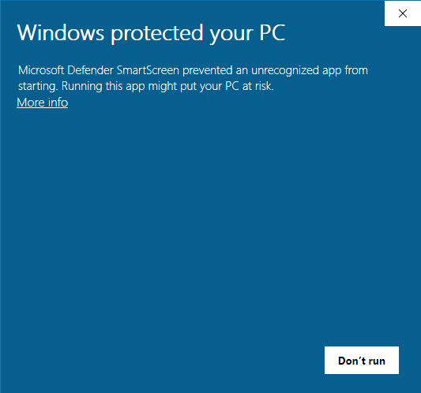
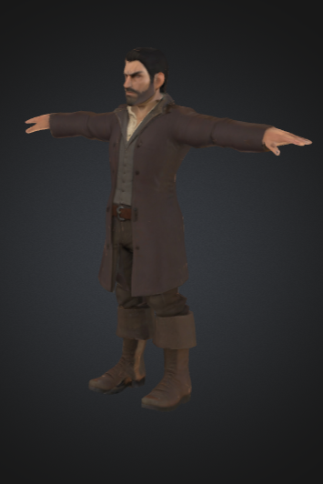
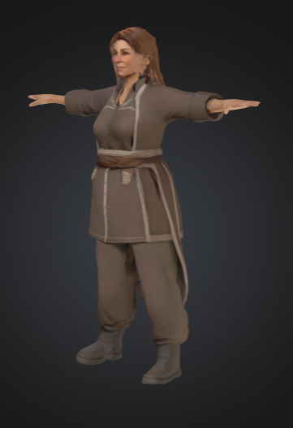
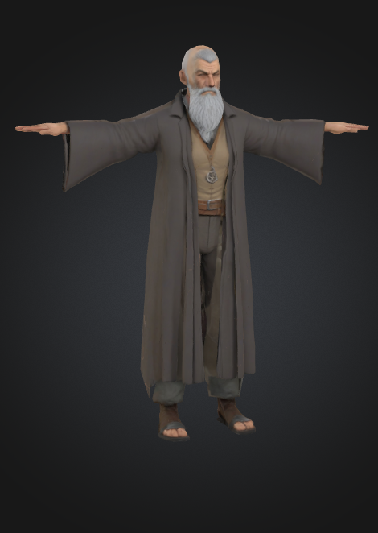
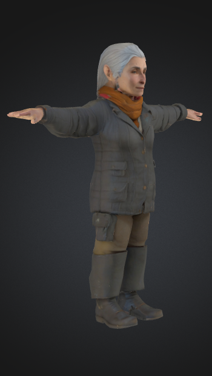

# Whispers of the Wild : Prompt.it Game Dev Submission
<i>An AI-Powered Fantasy Adventure</i>
<b>Built at the intersection of storytelling, artificial intelligence, and immersive gameplay.</b>

Whispers of the Wild is a narrative-rich fantasy game where every interaction with the world feels alive. At its core lies a revolutionary system of AI-powered NPCs—each with a distinct personality, backstory, and evolving knowledge pool—enabled by cutting-edge AI models.

### Storyline
The valley was once deeply connected to the natural world, guided by ancient wisdom symbolised by a hidden artifact known as the "Heartseed." Over time, this connection faded, the artifact was lost or hidden for safekeeping, and the valley became more mundane. Now, subtle signs – the "whispers" – suggest something is stirring. The player arrives, perhaps drawn by intuition or vague rumours, and must piece together the clues held by the valley's few inhabitants to rediscover the Heartseed and understand its significance.

 0-3 screenshot.png>)

### Full Game Walkthrough (Youtube Unlisted)
https://youtu.be/n_BRV4jSGD8 (Don't miss the core game mechanic towards the end)

   1-29 screenshot.png>)
   3-22 screenshot.png>)
   5-34 screenshot.png>)
  9-10 screenshot.png>)
  13-16 screenshot.png>)

### Google Drive Link

https://drive.google.com/drive/folders/1dQrjVqJenlnRpJ0MNh_s5Ai8T4ZDFQld?usp=sharing

### Core AI In-Game Features:
<ul>
<li><b>Intelligent NPCs </b>: Elara, Kael, Theron, and Lyra are powered by the GPT-4o Mini model, enabling context-aware, character-consistent interactions that evolve over time. ( to know more about how NPC Personas are defined, head over to the AI Usage Reports in Google Drive !! )</li>
<li><b>Unique Knowledge Pools </b>: Each NPC "remembers" its world, offering depth, secrets, and lore unique to your conversations.</li>
</ul>

### AI Tools Used
<table style="width:100%; border-collapse: collapse; font-family: Arial, sans-serif;">
  <thead>
    <tr style="background-color: #333; color: white;">
      <th style="padding: 12px; text-align: left; border: 1px solid #ddd;">Component</th>
      <th style="padding: 12px; text-align: left; border: 1px solid #ddd;">Technology</th>
    </tr>
  </thead>
  <tbody>
    <tr>
      <td style="padding: 10px; border: 1px solid #ddd;">NPC Intelligence</td>
      <td style="padding: 10px; border: 1px solid #ddd;">GPT-4o Mini</td>
    </tr>
    <tr >
      <td style="padding: 10px; border: 1px solid #ddd;">Character & 3D Prop Generation/Texturing</td>
      <td style="padding: 10px; border: 1px solid #ddd;">Meshy AI, Hunyuan 3D v2.5</td>
    </tr>
    <tr>
      <td style="padding: 10px; border: 1px solid #ddd;">Auto-Rigging & Bone Binding</td>
      <td style="padding: 10px; border: 1px solid #ddd;">Mixamo (AI-Powered)</td>
    </tr>
    <tr >
      <td style="padding: 10px; border: 1px solid #ddd;">Game Scripts & Logic</td>
      <td style="padding: 10px; border: 1px solid #ddd;">Gemini Flash 2.5</td>
    </tr>
    <tr>
      <td style="padding: 10px; border: 1px solid #ddd;">Story & Mechanics Design</td>
      <td style="padding: 10px; border: 1px solid #ddd;">Co-created via ChatGPT & Gemini Conversations</td>
    </tr>
    <tr>
      <td style="padding: 10px; border: 1px solid #ddd;">Game Engine</td>
      <td style="padding: 10px; border: 1px solid #ddd;">Unity Personal (Unity Muse enabled)</td>
    </tr>
  </tbody>
</table>

### Theme
#### AI Characters that Evolve & Learn

"Whispers of the Wild" exemplifies games with evolving or learning AI characters through several key mechanics:

1.  **Evolving Knowledge Pools:**
    * The core design features NPCs with "evolving knowledge pools." This means their understanding isn't static and can be updated by new information or player progression.
    * **Example:** Theron processes player-relayed information about carvings (from Kael) to provide relevant lore. Lyra only offers specific guidance to the "Watcher's Perch" after the player shares Theron's legend, showing her knowledge and subsequent actions are updated.

2.  **Conditional & Adaptive Responses:**
    * NPCs adapt their behavior and the information they share based on player actions and earned trust.
    * **Example:** Elara becomes less reserved as trust is earned. Kael's skepticism can give way to helpfulness if the player demonstrates respect or knowledge, showing he "learns" about the player's character.

3.  **Information-Gated Progression:**
    * The narrative progresses because NPCs "learn" what the player has discovered from others. They then provide the next piece of the puzzle, reacting to the evolving context the player brings.
    * This creates a dynamic chain where each NPC's output is influenced by the player's input, which represents new knowledge for that NPC at that moment.

4.  **Player Engagement Dependent Interaction:**
    * The requirement for players to be attentive for NPCs to guide them implies an AI that "learns" or gauges player investment before revealing crucial details, adapting its willingness to help.

In essence, while not undergoing radical personality shifts, the AI in "Whispers of the Wild" demonstrates learning by integrating new information (from the player or environment), adapting responses based on player behavior, and evolving the knowledge they dispense as the story unfolds. This creates a more dynamic and interactive narrative experience than with static NPCs.

### How to Install
1. Open the Google Drive Link provided above ( https://drive.google.com/drive/folders/1dQrjVqJenlnRpJ0MNh_s5Ai8T4ZDFQld?usp=sharing )

2. Download Whispers of the Wild Build.zip file.
3. Extract from the zip
4. Click on Whispers of the Wild.exe
5. You might see a blue Window Screen like below : 

6. No issues. Click on More Info -> Run Anyways

7. You should see this screen:

8. Yay! Whispers of the Wild is now ready to play !

 0-3 screenshot.png>)

### How to Play:

Controls:
1. Up/Down/Left/Right : For movement
2. Spacebar : To jump
3. TAB Key : To open Chat UI when in Interaction Range of any NPC. (Note. Movement capability is freezed when Chat UI is enabled)
4. Type your questions in the Input Box and press Enter / or click Send button. Wait for NPC to respond.
5. Press TAB Key again to disable UI Chat Interface. Your movement capability will be restored.
6. Goodluck finding the Heartseed
7. In order to exit from the game, press Windows Key which should reveal the Taskbar.

### System Requirements
1. Recommended to have atleast 8 GB RAM
2. Please close any other apps in background for better performance (FPS)

### AI Non Playable Characters 
### Kael Stonehand (The Forest Woodman)

### Elara Meadowlight (The Orchard Keeper)

 

### Theron Greycloak (The Hilltop Sage)

### Lyra Watersong (The Lakeside Listener)

### Licenses and Attributes

1. Free Sample Environment of Polytope Studio LowPoly Environment

   https://assetstore.unity.com/packages/3d/environments/lowpoly-environment-nature-free-medieval-fantasy-series-187052
    
   Standard Unity Asset Store EULA License

2. Unity Starter Asset First Person Controller

   https://assetstore.unity.com/packages/essentials/starter-assets-firstperson-updates-in-new-charactercontroller-pa-196525

   Non-Standard EULA License

3. Pixabay Dropping Rocks soundtrack
   Artist : iwanPlays (Freesound)

   https://pixabay.com/sound-effects/dropping-rocks-5996/

4. Pixabay Landslide Soundtrack
   Artist : SoundReality

   https://pixabay.com/sound-effects/landslide-128314/

5. Pixabay Forest Atmosphere Soundtrack
   Artist : AudioPapkin
   https://pixabay.com/sound-effects/forest-atmosphere-009localization-poland-330009/
